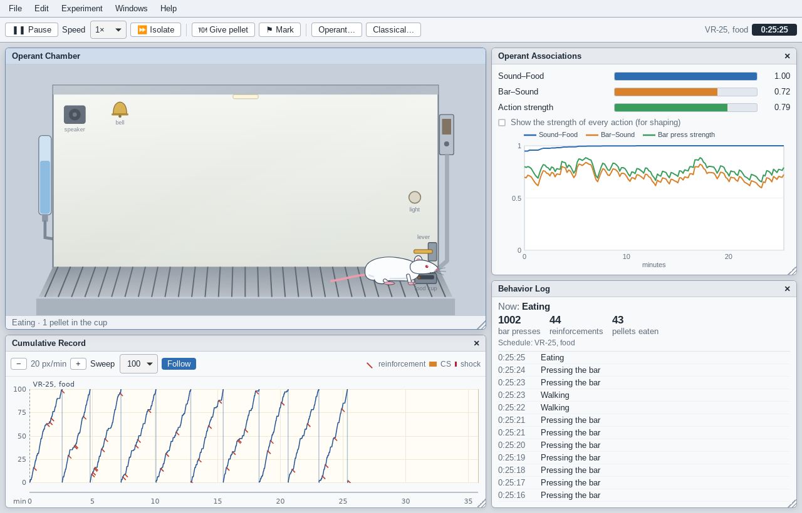

# Rattus

**A virtual rat in an operant chamber, for learning about classical and operant conditioning.**

Rattus is a free, open-source desktop app inspired by the educational program *Sniffy, the Virtual Rat*. A cartoon rat lives in a Skinner box with a lever, a food dispenser, a water spout, a light, a speaker, a bell and a shock grid. You train it the way psychologists train real rats, watch its behaviour change, record the data, and look into its "mind" to see the learning processes behind the behaviour.

> **Resumo em português:** o Rattus é uma versão de código aberto de uma caixa de Skinner virtual, inspirada no *Sniffy, the Virtual Rat*. Dá para fazer o treino ao comedouro, modelar a pressão à barra, estudar extinção, recuperação espontânea, reforço secundário e esquemas de reforço (FR, VR, FI, VI), e condicionar medo (CER) com luz, tom e campainha. Os instaladores para Windows, macOS e Linux ficam na página de [Releases](https://github.com/barbieri97/rattus/releases). A interface está em inglês.



## Download

Get the installer for your system from the [latest release](https://github.com/barbieri97/rattus/releases/latest):

| System | File |
| --- | --- |
| Windows 10/11 | `Rattus_<version>_x64-setup.exe` or `.msi` |
| macOS 10.15+ (Intel and Apple silicon) | `Rattus_<version>_universal.dmg` |
| Linux | `.AppImage` (any distribution), `.deb` (Debian/Ubuntu) or `.rpm` (Fedora/openSUSE) |

The installers are not code-signed yet. On Windows, click **More info ▸ Run anyway** in the SmartScreen warning. On macOS, right-click the app and choose **Open** (or use **System Settings ▸ Privacy & Security ▸ Open Anyway**; if macOS says the app is damaged, run `xattr -cr /Applications/Rattus.app`).

## What you can do

- **Magazine training**: give pellets by hand (Space bar, or click the lever) until the dispenser click predicts food.
- **Shaping**: reinforce successive approximations until the rat presses the bar; then shape begging, face wiping or rolling over.
- **Extinction and spontaneous recovery**: stop reinforcing, then send the rat to its home cage for a while and watch responding come back.
- **Secondary reinforcement**: extinguish with the click alone and compare with complete extinction.
- **Schedules of reinforcement**: continuous, fixed and variable ratio, fixed and variable interval, with their typical cumulative records, and the partial reinforcement effect in extinction.
- **Classical conditioning of fear (CER)**: pair a light, a tone (at different intensities) or a bell with shock while a trained rat presses the bar; follow acquisition, extinction and spontaneous recovery in the suppression ratio.

Data windows show the **cumulative record**, the **suppression ratio** and **movement ratio** per trial and a **behaviour log**. Mind windows show **Operant Associations** (sound–food, bar–sound, action strength), **CS Response Strength** and **Sensitivity & Fear**. Experiments can be saved and reopened, data exported as CSV, and any data window copied to the clipboard (Edit ▸ Copy) for a spreadsheet. Isolating the rat accelerates time (up to 3600×) so long experiments take seconds.

Step-by-step exercises are in the app (Help ▸ Quick Guide) and in [docs/exercises.md](docs/exercises.md). How the rat learns is described in [docs/learning-model.md](docs/learning-model.md).

## Development

Rattus is a [Tauri 2](https://tauri.app) app: the simulation is written in Rust and the interface in Vue 3 + TypeScript.

```
crates/rattus-core   the simulation (pure Rust, no UI): behaviour, learning, schedules, recording, files
src-tauri            the desktop shell: runs the simulation on a thread and streams frames to the UI
src                  the Vue interface: animated chamber (SVG), data and mind windows, dialogs
.github/workflows    CI and the release workflow that builds the installers
```

Prerequisites: [Rust](https://rustup.rs) (stable), [Node.js](https://nodejs.org) 22 or newer, and on Linux the WebKitGTK libraries:

```sh
sudo apt install libwebkit2gtk-4.1-dev librsvg2-dev libayatana-appindicator3-dev patchelf   # Debian/Ubuntu
```

(See the [Tauri prerequisites](https://tauri.app/start/prerequisites/) for other systems.)

```sh
npm install
npm run tauri dev       # run the app with hot reload
npm run tauri build     # build the installers for your system
```

Checks run by CI:

```sh
cargo fmt --all --check
cargo clippy --workspace --all-targets -- -D warnings
cargo test --workspace            # includes tests/phenomena.rs: the learning phenomena, headless
npm run format:check && npm run typecheck && npm test
```

Useful while working on the model or the drawing:

- `cargo run -p rattus-core --example session -- all 1` runs the classic exercises headless and prints response rates and suppression ratios.
- `npm run dev` and then <http://localhost:1420/?gallery> (add `&zoom` to zoom in) shows every pose of the rat in the chamber.
- The TypeScript types in `src/bindings` are generated from the Rust types by `cargo test -p rattus-core`; commit them when the protocol changes.

### Releasing

1. Update `version` in `package.json` (the app reads its version from there) and in the workspace `Cargo.toml`.
2. Commit, then create and push a matching tag: `git tag v0.2.0 && git push origin v0.2.0`.
3. The **Release** workflow builds the installers on Windows, macOS and Linux and publishes them as a GitHub Release. Running the workflow by hand builds the installers as downloadable artifacts without publishing a release.

## License

[MIT](LICENSE).

Rattus is an independent project. It is not affiliated with or endorsed by the authors or publishers of *Sniffy, the Virtual Rat*, and it uses none of its code, images or text.
